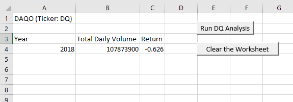
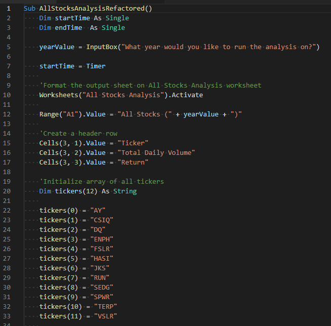
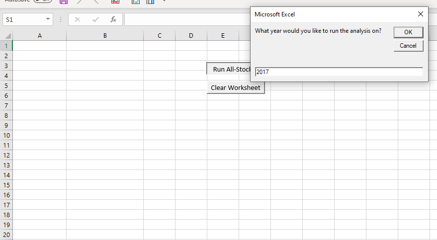
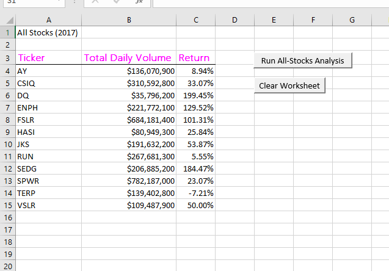
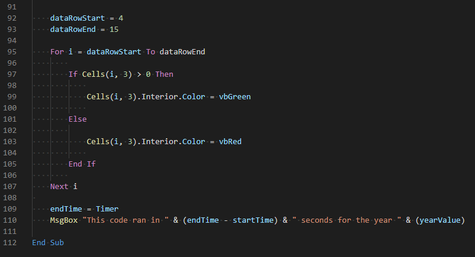
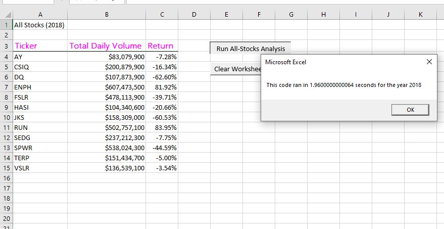

# VBA_Challenge
Summary
___
Steve's parents want to invest in green energy company Daqo (DQ). To analyze Daqo and other green energy stocks, Steve will use Excel VBA to automate his code.

The document [VBA_Challenge.xlsm](VBA_Challenge.xlsm) includes the macros Steve can use for his analysis. Additionally, at the click of a button, he can perform multi-year analyis! 

Objective
___

Steve's parents want to know how actively DQ was traded in 2018. They believe that if a stock is traded often, then the price will accurately reflect the value of the stock. If we sum up all of the daily volume for DQ, we'll have the yearly volume and a rough idea of how often it gets traded. 

Steve may want to look at a different set of stocks in the future. With this in mind, we created a flexible macro for running multiple stocks over the last few years.
 

We added buttons to quickly access to data for each year Steve wants to analyze.

To help Steve determine how fast his VBA code will compile the results.

